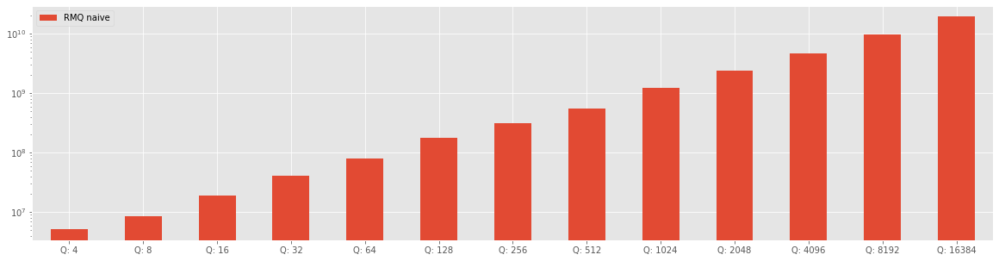
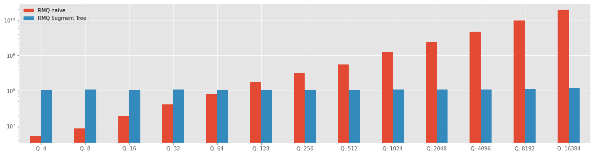
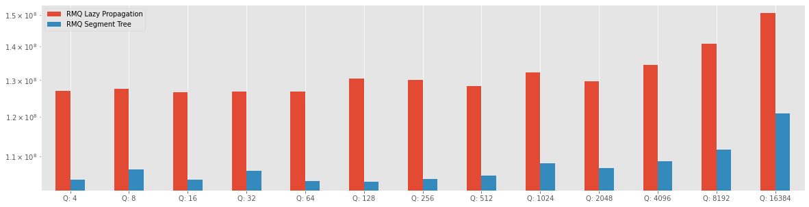

# Range Mininum Query Benchmarck

The solution at the problem Range Minimum Query was proposed with tree different solution, such as, Naive Solution, Segment Tree solution, and an improvement of performance with Segment Tree with Lazy propagation.

All the implementation of the this solution are on the Repository [Competitive-Programming-and-Contests-VP-Solution](https://vincenzopalazzo.github.io/Competitive-Programming-and-Contests-VP-Solution/Appendix/report_experiment/RMQ/) and the implementation of Segment Tree and Segment Tree with Lazy Propagation are on the repository [cpstl](https://vincenzopalazzo.github.io/cpstl/).

## Range Mininum Query (RMQ) problem.

Given an array A of size N, there are two types of queries on this array.

- Query(start, end): In this query you need to print the minimum in the sub-array.
- Update(start, end, value): In this query you need to update.

An online Judge to solve this problem is [hackerearth](https://www.hackerearth.com/practice/data-structures/advanced-data-structures/segment-trees/practice-problems/algorithm/range-minimum-query/) and the solution are discussed on the paper [Segment Tree a complete introduction](#TODO)

## Benchmarks on solutions

The benchmark are discussed one after than other and at the end we have some comparison.

The banchmark are runned over a Fixed number of array element (2^21) and on a increase range of query that start from X and finished to Y. (TODO add numbers)


### Naive solution

The naive solution is to use two nested loop to scan for each query we search the minimum value.
This solution is good for the update on the original array, beacuse the time complexity is O(1), but the query time complexity is O(N), and the final time complexity is O(N*Q), where the N is the size of array and Q is the number of queries.

In the chart below there is a chart of the benchamark for this solution.


```python
from core_chart import (make_naive_benchmark_chart,  make_segment_tree_and_naive_benchmark_chart, 
                        make_segment_tree_lazy_segment_treee_benchmark_chart)

make_naive_benchmark_chart()
```


    

    


With this benchmark is possible noted that the solution is very slow for a big numbers of queries.

### Segment Tree solution

The RMQ is a problem where the Segment Tree work very well, and in the following chart we can see
an comparison with the naive solution


```python
make_segment_tree_and_naive_benchmark_chart()
```


    

    


With this comparison is possible see how the segment tree is fast to execute this type of queries, and how the naive solution is a very bad because repeate some calculation on the array that can be avoided. However, the version of RMQ proposed to [hackerearth](https://www.hackerearth.com/practice/data-structures/advanced-data-structures/segment-trees/practice-problems/algorithm/range-minimum-query/) required to answer also to some update query that make some change inside the original array, and this change make some alteration inside the Segment Tree.

How described in the Section Lazy Propagation of the Paper (TODO ADD link), when the uèdate on a range are frequentlly it is possible improve the performance of the Segment Tree to implement the Lazy Propagation technique, that is a method to avoid the update of the Segment Tree at the update time and pospone the update only  when it is requiredn. However, not in all the case the lazy propagation is the better choise, because we need to know also the dimension of this update on the range, in the case of RMQ problem on [hackerearth](https://www.hackerearth.com/practice/data-structures/advanced-data-structures/segment-trees/practice-problems/algorithm/range-minimum-query/) it is a simple update to only one element of the array and with this implementation it is tricky understend what is the better datastructure to use. For this reason, in the section below was described a code benchmark of RMQ solution with Segment Tree and another version of solution with Lazy propagnation (LazySegmentTree).


```python
make_segment_tree_lazy_segment_treee_benchmark_chart()
```


    

    


We can observe that the RQM solution with lazy propagation is slower in  that the solution with 
the Segment Tree. The cause of this result can be the type of Update on the range, because in this case the update it is only on one element of the range and not in one sub-range and the lazy technique implementation inside the Segment tree can make the query operation slower.
