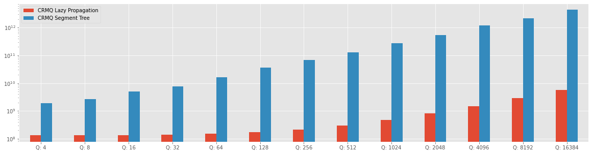

# Circular Range Minimum Query benchmarks

The solution at the problem Range Minimum Query was proposed with three different solutions, such as Naive Solution, Segment Tree solution, and an improvement of performance with Segment Tree with Lazy propagation.

All the implementation of this solution are on the Repository [Competitive-Programming-and-Contests-VP-Solution](https://vincenzopalazzo.github.io/Competitive-Programming-and-Contests-VP-Solution/Appendix/report_experiment/RMQ/) and the implementation of Segment Tree and Segment Tree with Lazy Propagation are on the repository [cpstl](https://vincenzopalazzo.github.io/cpstl/).

## Circular Range Minimum Query (RMQ) problem.

Circular RMQ is a problem available on [codeforce](https://codeforces.com/problemset/problem/52/C) that asks to answer two types of queries on a circular array, where also the query the operation is circular, so that can contain a circular segment.

Where the query type are:

	- Increment (L, R, value): Increases each element on the segment [L, R] (inclusively) by the value;
	- RMQ(value, index): returns minimal value on the segment [L, R] (inclusively). 
    
[On the repositiory](https://vincenzopalazzo.github.io/Competitive-Programming-and-Contests-VP-Solution/Appendix/report_experiment/RMQ/) there are two solutions that solve the problem with Segment Tree and a Segment tree with Lazy Propagation.
In addition to this solution, we will see that the solution with the lazy propagation technique is faster with the update on a sub-range [L, R] than the Segment Tree. However, the lazy propagation doesn't have the same benefit with the update on a single element, how we can see in the [RMQ benchmarks](https://vincenzopalazzo.github.io/Competitive-Programming-and-Contests-VP-Solution/Appendix/report_experiment/RMQ/).

### Segment Tree solution vs Lazy Segment Tree

The solution proposed is the same for both Segment tree implementations, the only change is the logic inside the implementation, but a solution used in the benchmark is reported below

```cpp
template <typename T>
struct Query {
    size_t start;
    size_t end;
    T update_val = INT64_MAX;
    bool update = false;
 
    Query(size_t start, size_t anEnd) : start(start), end(anEnd) {}
    Query(size_t start, size_t anEnd, T updateVal, bool update) : start(start), end(anEnd), update_val(updateVal),
                                                                  update(update) {}
};
 
template <typename T>
std::vector<T> calculate_minimum_rmq_query_lazy(cpstl::LazySegmentTree<T> &segmentTree, std::vector<Query<T>> const &queries)
{
    std::vector<T> results;
    for (auto &query : queries) {
        if (query.start > query.end) {
            if (query.update) {
                segmentTree.update_range(0, query.end, query.update_val);
                segmentTree.update_range(query.start, segmentTree.size() - 1, query.update_val);
                continue;
            }
            //Is a circular RMQ query
            auto val_one = segmentTree.range_query(0, query.end);
            auto val_two = segmentTree.range_query(query.start, segmentTree.size() - 1);
            auto min = std::min(val_one, val_two);
            results.push_back(min);
            continue;
        }
        if (query.update) {
            segmentTree.update_range(query.start, query.end, query.update_val);
            continue;
        }
        // It is a normal RMQ query
        auto val = segmentTree.range_query(query.start, query.end);
        results.push_back(val);
    }
    return results;
}

```

With this problem, we have a lot of difference in resolution time between the two different implementations, how the Figure below shows.


```python
from core_chart import make_comparison_chart

make_comparison_chart()
```


    

    


The chart shows that the Segment Tree implementation without lazy propagation is slower than the Segment Tree with Lazy Propagation. However, the performance of Segment Tree could be improved with some a good implementation of update range, but this will not cover in this research because the Segment Tree works well with the update at one single position how the RMQ benchmarks show. For this reason, we will use the Segment Tree with Lazy propagation when we need to make updates on a sub-range.
