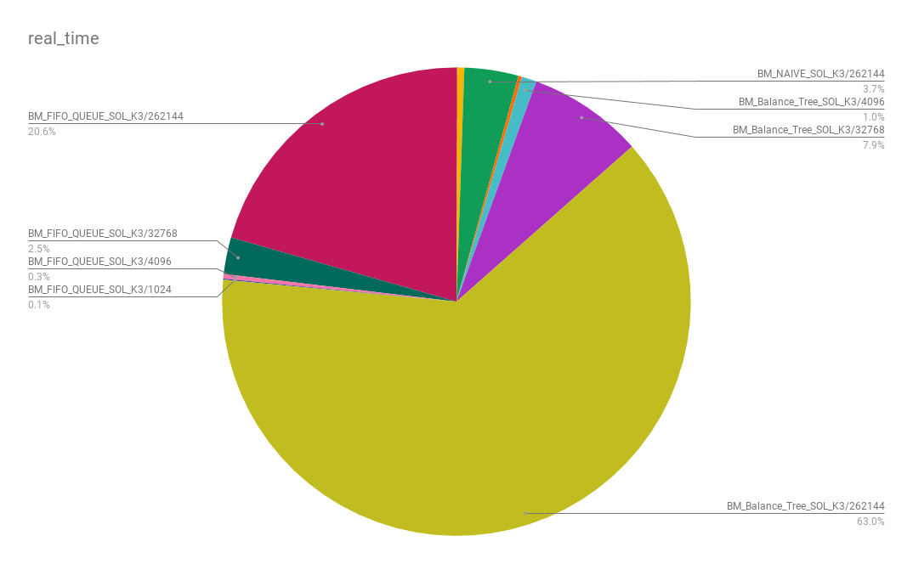
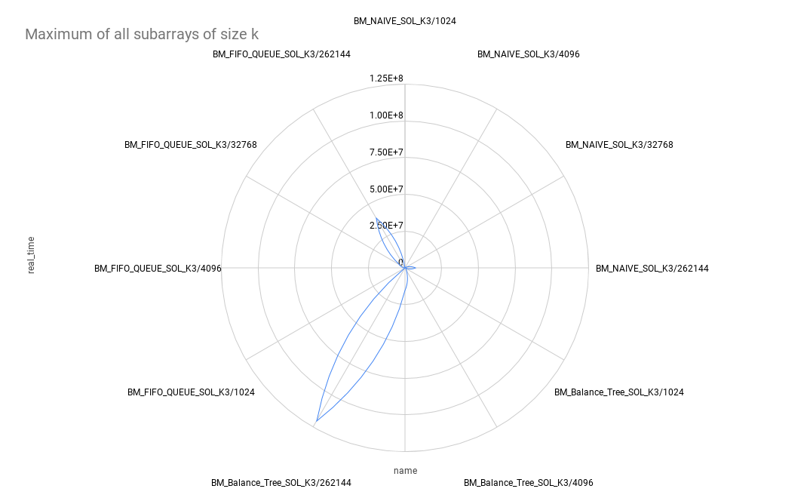

# Maximum of all subarrays of size k

[Online submission](https://practice.geeksforgeeks.org/viewSol.php?subId=d222beb3ec864172e96d4bfa5b7a5969&pid=451&user=vpalazzo1)

### Benchmark Result

### Pie Chart

### Radat chart

